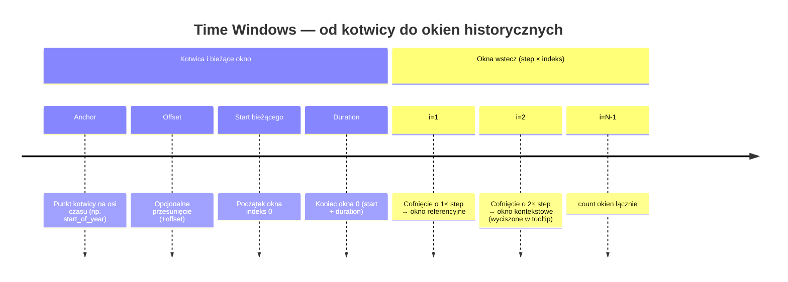
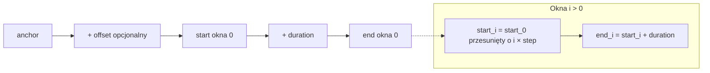

# Wiki (draft): Time Windows — parametry i oś czasu

Treść do wklejenia lub zaadaptowania w wiki projektu **Energy Horizon**. Odpowiada funkcji `001-time-windows-engine`.

## Po co jest Time Windows

Zamiast osobnych, sztywnych trybów w kodzie, karta buduje **listę okien czasowych**. Każde okno ma swoje granice `start` i `end` oraz opcjonalnie inną **agregację** (np. dzień, godzina). Dzięki temu można dodawać kolejne okresy historyczne i obsługiwać niestandardowe cykle rozliczeniowe — konfiguracją YAML.

## Parametry

| Parametr | Znaczenie |
|----------|-----------|
| `anchor` | **Kotwica** — punkt na osi czasu, względem którego liczymy początek bieżącego okna (np. początek roku, miesiąca, godziny). |
| `offset` | **Przesunięcie** względem kotwicy (np. przesunięcie startu roku rozliczeniowego o kilka miesięcy). |
| `duration` | **Długość** jednego okna — ile czasu trwa wizualizowany zakres po wyliczeniu startu. |
| `step` | **Krok** wstecz między kolejnymi oknami. W YAML podajesz wartość dodatnią; dla okna o indeksie `i` pełne cofnięcie to `i × step`. |
| `count` | **Liczba okien** do wygenerowania (np. 2 = bieżące + jedno wstecz). |
| `aggregation` | **Granulacja** pobieranych danych (np. `day`, `month`, `hour`) — formalnie należy do konfiguracji okna. |

## Preset `comparison_mode`

Dotychczasowy `comparison_mode` to **preset**: zestaw domyślnych wartości powyższych pól. Jeśli dodasz blok `time_window`, **nadpisujesz tylko to, co wpiszesz** — reszta zostaje z presetu.

Przykład: `comparison_mode: year_over_year` + `time_window: { duration: … }` zmienia wyłącznie szerokość okna, nie zerując pozostałych ustawień.

## Okna 0, 1, 2… na wykresie

- **Okno 0** — seria bieżąca (jak dziś).
- **Okno 1** — seria referencyjna (jak dziś): udział w statystykach, prognozach, tooltipie.
- **Okna 2+** — **kontekst wizualny**: rysowane w tle (styl zbliżony do referencji), **bez wpływu na prognozy** i **bez wartości w tooltipie** (tooltip pokazuje tylko okna 0 i 1).

## Oś X

Oś pozioma ma długość **najdłuższego** z wygenerowanych okien. Jeśli jedno okno jest krótsze (np. luty vs marzec), seria **urywa się** na ostatnim punkcie — bez rozciągania wartości w prawo.

## Notacja czasu

W konfiguracji używaj jednoznacznej notacji okresów (w dokumentacji końcowej podaj dokładną składnię — np. w stylu narzędzi analitycznych: `1y`, `6M`, `30d`, `1h`). Wielkość liter ma znaczenie tam, gdzie to zdefiniuje implementacja.

---

## Diagram: łańcuch czasu (Mermaid)

Poniżej: od kotwicy do końca **pierwszego** okna oraz generowanie kolejnych okien przez `step`.

Alternatywnie, diagram przepływu (bardziej techniczny):

## Przykłady YAML (skrót)

**Dwa kolejne miesiące** — ustaw `anchor` na początek miesiąca, `duration` = 1 miesiąc, `step` = 1 miesiąc, `count: 2`.

**Month over year** — `duration` = 1 miesiąc, `step` = 1 rok, `count: 2`.

**Rok rozliczeniowy od października** — kotwica roczna + `offset` przesuwający start na 1 października, `duration` = 1 rok, `step` = 1 rok, `count: 2`.

Pełne przykłady znajdują się w specyfikacji funkcji `specs/001-time-windows-engine/spec.md` (sekcja wejściowa użytkownika / acceptance).
