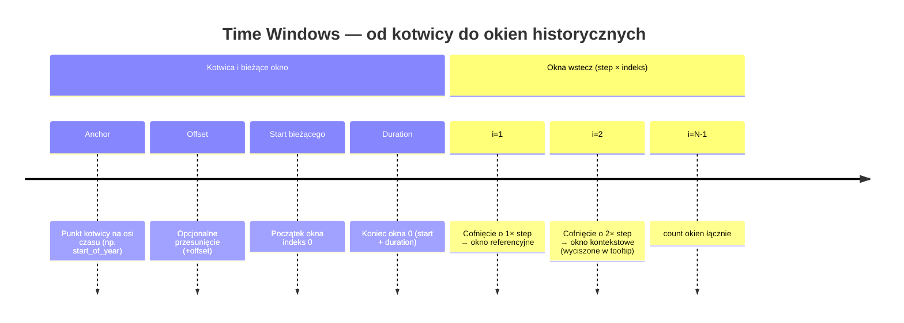
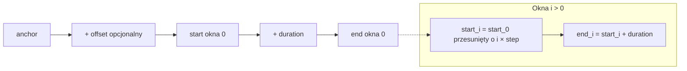

# Wiki (draft): Time Windows — parametry i oś czasu

Treść do wklejenia lub zaadaptowania w wiki projektu **Energy Horizon**. Odpowiada funkcji `001-time-windows-engine`.

**Implementacja (repozytorium)**: moduły w `src/card/time-windows/`; szczegóły przepływu — `speckit.md` (sekcja Time Windows) oraz `README.md` → [Time windows (advanced YAML)](../../README.md#time-windows-advanced-yaml). Testy jednostkowe presetów uruchamiane są z `TZ=UTC` (`npm test`).

## Po co jest Time Windows

Zamiast osobnych, sztywnych trybów w kodzie, karta buduje **listę okien czasowych**. Każde okno ma swoje granice `start` i `end` oraz opcjonalnie inną **agregację** (np. dzień, godzina). Dzięki temu można dodawać kolejne okresy historyczne i obsługiwać niestandardowe cykle rozliczeniowe — konfiguracją YAML.

## Parametry

| Parametr | Znaczenie |
|----------|-----------|
| `anchor` | **Kotwica** — punkt na osi czasu, względem którego liczymy początek bieżącego okna (np. początek roku, miesiąca, godziny). |
| `offset` | **Przesunięcie** względem kotwicy (np. przesunięcie startu roku rozliczeniowego o kilka miesięcy). |
| `duration` | **Długość** jednego okna — ile czasu trwa wizualizowany zakres po wyliczeniu startu. |
| `step` | **Krok** wstecz między kolejnymi oknami. W YAML podajesz wartość dodatnią; dla okna o indeksie `i` pełne cofnięcie to `i × step`. |
| `count` | **Liczba okien** do wygenerowania (np. 2 = bieżące + jedno wstecz). |
| `aggregation` | **Granulacja** pobieranych danych (np. `day`, `month`, `hour`) — formalnie należy do konfiguracji okna. |

## Twarde limity techniczne (LTS)

Dane wykresu pochodzą z **statystyk długoterminowych (LTS) / rekordera** Home Assistant. W praktyce minimalna rozdzielczość sensowna dla tej karty to **1 godzina** — poniżej tego poziomu konfiguracja jest **odrzucana** (błąd karty przy zapisie konfiguracji), bez autokorekty wartości.

Powiązanie z tabelą parametrów powyżej:

- **Nie używaj** kotwic innych niż `start_of_year`, `start_of_month`, `start_of_hour`, `now` (np. **`start_of_minute`** — niedozwolone).
- **`duration`** musi po parsowaniu odpowiadać co najmniej **1 h** (np. `30m` — błąd; `1h`, `90m` — OK).
- **`aggregation`** (także na poziomie karty, po scaleniu z `time_window`) musi być jednym z `hour`, `day`, `week`, `month` albo **pominięte** (wtedy domyślne `day` jest nadal „brak jawnej wartości”, nie naprawa złego tokenu). Wartości typu `5m` są **niedozwolone**.

Jeśli utrzymujesz osobną [GitHub Wiki](https://github.com/hello-sebastian/energy-horizon/wiki), zsynchronizuj ten akapit po zmianach w repozytorium (patrz nagłówek tego pliku).

## Preset `comparison_preset` (UI: Comparison Preset)

W YAML kanonicznym kluczem jest **`comparison_preset`** (dawniej `comparison_mode`; legacy nadal działa). Preset to **zestaw domyślnych wartości** powyższych pól. Jeśli dodasz blok `time_window`, **nadpisujesz tylko to, co wpiszesz** — reszta zostaje z presetu.

Przykład: `comparison_preset: year_over_year` + `time_window: { duration: … }` zmienia wyłącznie szerokość okna, nie zerując pozostałych ustawień.

### `month_over_month` — dwa kolejne miesiące kalendarzowe

Preset **`month_over_month`** odpowiada szablonowi: kotwica `start_of_month`, `duration: 1M`, `step: 1M`, `count: 2` (bez flag legacy YoY/MoY). Silnik generuje:

- **okno 0** — bieżący miesiąc kalendarzowy (od 1. dnia miesiąca do końca tego miesiąca),
- **okno 1** — **poprzedni** pełny miesiąc kalendarzowy (nie „ten sam miesiąc rok temu”; to jest `month_over_year`).

Minimalny YAML:

```yaml
type: custom:energy-horizon-card
entity: sensor.twoja_statystyka
comparison_preset: month_over_month
aggregation: day
```

Oś X wykresu ma długość **najdłuższego** z dwóch okien; prognoza (jeśli włączona) opiera się na **oknie 0** (FR-017).

## Okna 0, 1, 2… na wykresie

- **Okno 0** — seria bieżąca (jak dziś).
- **Okno 1** — seria referencyjna (jak dziś): udział w statystykach, prognozach, tooltipie.
- **Okna 2+** — **kontekst wizualny**: rysowane w tle (styl zbliżony do referencji), **bez wpływu na prognozy** i **bez wartości w tooltipie** (tooltip pokazuje tylko okna 0 i 1).

## Oś X

Oś pozioma ma długość **najdłuższego** z wygenerowanych okien. Jeśli jedno okno jest krótsze (np. luty vs marzec), seria **urywa się** na ostatnim punkcie — bez rozciągania wartości w prawo.

## Prognoza

Oś może być **dłuższa** niż okno bieżące (indeks 0), gdy któreś z pozostałych okien ma większą rozpiętość. **Prognoza** liczy wtedy ukończenie okresu i progi procentowe wyłącznie względem **okna bieżącego**, a nie względem liczby „slotów” na osi X — tak aby szacunek końca okresu pozostał spójny z parą bieżąca / referencyjna (spec: FR-017).

## Notacja czasu

W konfiguracji używaj jednoznacznej notacji okresów (w dokumentacji końcowej podaj dokładną składnię — np. w stylu narzędzi analitycznych: `1y`, `6M`, `30d`, `1h`). Wielkość liter ma znaczenie tam, gdzie to zdefiniuje implementacja.

---

## Diagram: łańcuch czasu (Mermaid)

Poniżej: od kotwicy do końca **pierwszego** okna oraz generowanie kolejnych okien przez `step`.



Alternatywnie, diagram przepływu (bardziej techniczny):



## Przykłady YAML (skrót)

**Dwa kolejne miesiące** — albo preset `comparison_preset: month_over_month`, albo ręcznie: `anchor` na początek miesiąca, `duration` = 1 miesiąc, `step` = 1 miesiąc, `count: 2`.

**Month over year** — `duration` = 1 miesiąc, `step` = 1 rok, `count: 2` (preset `month_over_year`).

**Rok rozliczeniowy od października** — kotwica roczna + `offset` przesuwający start na 1 października, `duration` = 1 rok, `step` = 1 rok, `count: 2`.

Pełne przykłady znajdują się w specyfikacji funkcji `specs/001-time-windows-engine/spec.md` (sekcja wejściowa użytkownika / acceptance).
